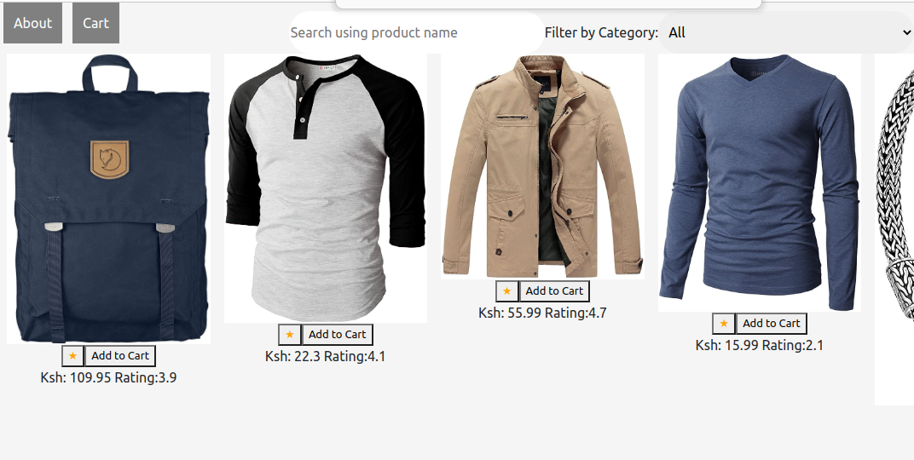

# Webstore 
## node v16.13.0
## API
Fake Store API https://fakestoreapi.com

Frontend for a webstore/shop that can be used by small businesses and creatives to promote sell their products
## User Story
### As A user I should be able to:
1. Explore all the products on the platform.
1. Filter products based on category.
1. Add a review to a product.
1. Search for a product using the product's name.
1. Add a product to cart .

## How to use the web application.
On opening the application the components visible are:
1. The NavBar containing link to the cart and about section of the application
1. All the products fetched from backend API
1. the search and filter elements.
1. Every products displays the ratings and price as well as button to add it to cart and rate the product
After adding items to cart click on the Cart link on the Navigation bar to view them. And to know more about the website click the about section
When at the About or the Cart section the main components of the site are still visible.
